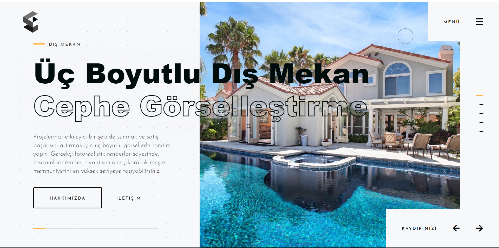
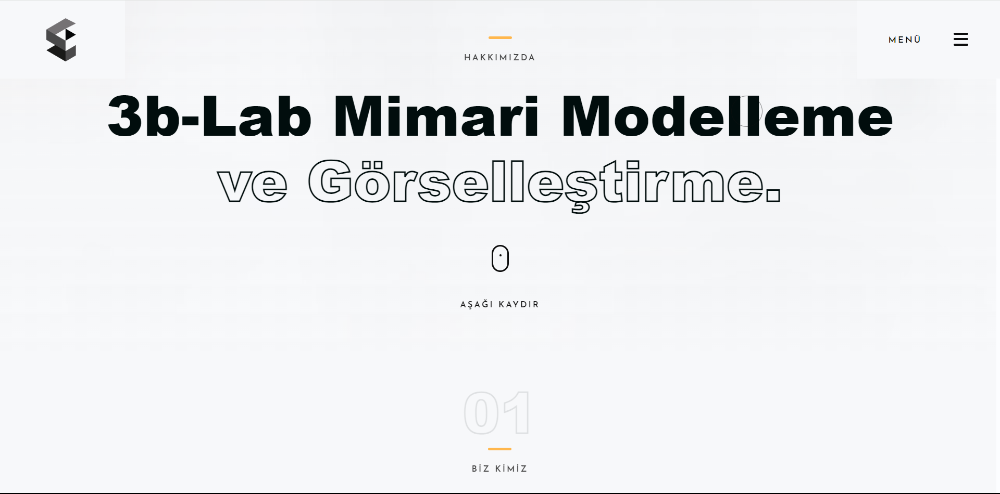
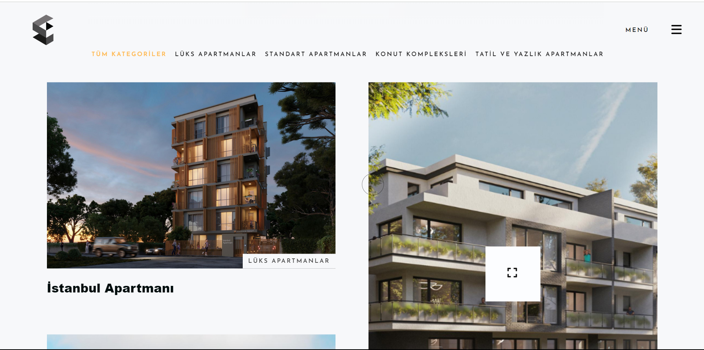

<h1 style="color:#3498db;">🏛️ 3dlabart Mimarlık Ofisi Web Sitesi</h1>

<strong style="color:#e74c3c;">Proje:</strong> 3dlabart Mimarlık Ofisi Web Sitesi

<strong style="color:#e74c3c;">Müşteri:</strong> 3dlabart Mimarlık Ofisi

<strong style="color:#e74c3c;">Kod Paylaşımı:</strong> Bu proje, müşteriye özel olduğu için kodlar paylaşılmamaktadır.

<h2 style="color:#2ecc71;">Proje Özeti</h2>

Bu proje, 3dlabart Mimarlık Ofisi için modern, estetik ve kullanıcı dostu bir web sitesi geliştirme üzerine odaklanmıştır. Web sitesi, firmanın 3D modelleme, dış cephe ve iç mekan tasarımı gibi hizmetlerini tanıtmak ve portföyünü sergilemek amacıyla tasarlanmıştır.

<h2 style="color:#2ecc71;">Öne Çıkan Özellikler</h2>
<ul>
    <li><strong style="color:#f39c12;">Portföy Sergisi:</strong> Firma tarafından tamamlanmış projelerin detaylı bilgileri ve görselleri.</li>
    <li><strong style="color:#f39c12;">Hizmet Tanıtımı:</strong> 3D modelleme, dış cephe tasarımı, iç mekan tasarımı gibi hizmetlerin kapsamlı tanıtımı.</li>
    <li><strong style="color:#f39c12;">Kullanıcı Dostu Arayüz:</strong> Ziyaretçilerin kolayca bilgi bulabilmesi için estetik ve etkili bir tasarım.</li>
    <li><strong style="color:#f39c12;">Duyarlı Tasarım:</strong> Mobil ve masaüstü cihazlarla uyumlu, esnek bir yapı.</li>
    <li><strong style="color:#f39c12;">İletişim Formu:</strong> Kullanıcıların hızlı ve kolayca iletişime geçebileceği bir form.</li>
</ul>

<h2 style="color:#2ecc71;">Görseller</h2>

Web sitesinin bazı bölümlerine ait görseller aşağıda sunulmuştur:

<!-- Görsel 1 -->

<!-- Görsel 2 -->

<h2 style="color:#2ecc71;">Websitesi Linki</h2>

Projeyi canlı olarak görmek için <a href="https://www.ornek-domein.com" target="_blank" style="color:#2980b9; text-decoration: none;">buraya tıklayın</a>.

<h2 style="color:#2ecc71;">İletişim</h2>

Bu projeyle ilgili detaylar veya geri bildirim için <a href="mailto:bugrabatuhanbasar@gmail.com" style="color:#c0392b; text-decoration: none;">buradan</a> bana ulaşabilirsiniz.

<em>Bu proje, 3dlabart Mimarlık Ofisi için özel olarak tasarlanmıştır ve müşteri ihtiyaçlarına göre geliştirilmiştir.</em>

